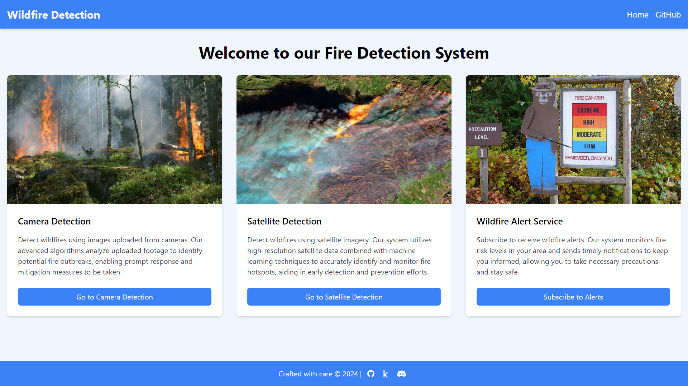

<h1 align="center">Forest Fire Risk Classification 🔥</h1>

<div align="center">
  
[](https://www.python.org/downloads/release/python-31013/)
[](https://flask.palletsprojects.com/en/3.0.x/)
[](https://www.tensorflow.org/)
[](LICENSE)
[](https://github.com/username/repo)

</div>


## Table of Contents 📚

1. [Background on Wildfires 🌍](#background-on-wildfires-)
2. [Project Overview 🚀](#project-overview-)
3. [Features 🌟](#features-)
4. [Screenshot 📸](#screenshot-)
5. [Installation 🛠️](#installation-%EF%B8%8F)
6. [Usage 💻](#usage-)
7. [File Structure 📁](#file-structure-)
8. [Requirements 📦](#requirements-)


## Background on Wildfires 🌍

Wildfires pose a significant environmental and economic threat worldwide. Their frequency and intensity have been escalating due to various factors, particularly climate change.

### Key Facts:

- **Global Impact**: Wildfires have caused devastating damage across various regions, from the Amazon Rainforest to Australia. In 2020, wildfires in California alone burned over 4.2 million acres【[Cal Fire](https://www.fire.ca.gov/incidents/2020/)】.
- **Frequency**: Over 100,000 wildfires occur annually in the U.S. alone【[National Geographic](https://www.nationalgeographic.com/environment/article/wildfires)】.
- **Economic Impact**: Wildfires cause an estimated $5 billion in damage annually in the U.S.【[Insurance Information Institute](https://www.iii.org/fact-statistic/facts-statistics-wildfires)】.
- **Climate Change**: Rising global temperatures and drier conditions are significantly increasing the risk and severity of wildfires【[NASA](https://climate.nasa.gov/news/2878/the-link-between-climate-change-and-wildfires/)】.

These alarming statistics underscore the urgent need for efficient wildfire detection and monitoring systems. Our **Wildfire Detection System** aims to address this need by leveraging cutting-edge technology to provide early detection and alerts, potentially saving lives and reducing damage.

## Project Overview 🚀

This project presents an innovative solution combining satellite imagery, camera feeds, and weather data to predict the risk of wildfires. Using advanced deep learning techniques, our system performs accurate predictions and provides timely alerts through a user-friendly Flask application. 

Our models include:
- **Satellite Classification CNN**: Using ResNet50v2, this model detects wildfire probabilities from satellite images with an accuracy of 97%.
- **Image Classification CNN**: Also based on ResNet50v2, this model identifies fires in uploaded images with an accuracy of 98%.
- **Weather Data Model**: This model predicts wildfire risks from meteorological data with an accuracy of 100%, albeit on a limited dataset.

## Features 🌟

- **Satellite Detection**: Detect wildfires using high-resolution satellite imagery.
- **Camera Detection**: Identify wildfire outbreaks through analysis of images from cameras or drones.
- **Weather Prediction**: Predict wildfire risks based on current and forecasted weather conditions.
- **Alert System**: Receive hourly email alerts about wildfire risks in specified locations.

## Screenshot 📸

Here's a glimpse of the Wildfire Detection System interface:



## Installation 🛠️

Follow these steps to set up the project locally:

1. **Clone the repository**:
   ```bash
   git clone  https://github.com/shahab7758/ForestFireRiskClassification-
   cd ForestFireRiskClassification-
   ```

2. **Create a virtual environment**:
   ```bash
   python3 -m venv venv
   source venv/bin/activate  # On Windows use `venv\Scripts\activate`
   ```

3. **Install dependencies**:
   ```bash
   pip install -r requirements.txt
   ```

   Make sure to run the Jupyter notebooks for model training and saving on Kaggle:
   - Open `wildfire-camera-detection.ipynb` and `wildfire-satellite-detection.ipynb` in Kaggle Notebooks to train and save the respective models.

4. **Set up environment variables**:
   Create a `.env` file and add your Mapbox token and other necessary configurations:
   ```bash
   MAPBOX_TOKEN=your_mapbox_token
   MAILERSEND_KEY=your_mailersend_key
   ```

5. **Initialize the database**:
   ```bash
   python -c 'from src.app import init_db; init_db()'
   ```

6. **Run the application**:
   ```bash
   python src/app.py
   ```

## Usage 💻

Once the application is running, navigate to the homepage to explore the features:

- **Home**: Overview and introduction to the system.
- **Camera Detection**: Upload images for wildfire detection.
- **Satellite Detection**: Analyze satellite data for wildfire hotspots.
- **Alert Service**: Subscribe for wildfire alerts for specific geographic areas.


## Requirements 📦

- **Python 3.10.13**
- **Flask 3.0.3**
- **TensorFlow 2.16.1**
- **Pandas 2.2.2**
- **Scikit-Learn 1.5.0**
- **Mailersend 0.5.6**
- **OpenMeteo SDK 1.11.7**
  

For the full list of dependencies, see the [requirements.txt](requirements.txt) file.


